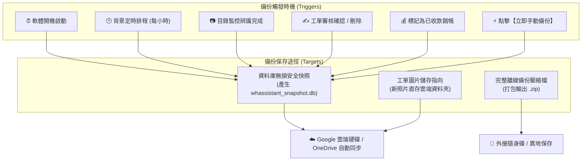

# WHassistant - 工單與收據智慧管理系統

<p align="center">
  <b>專為工程、維修與水電機電產業量身打造的本地智慧工單收據管理系統</b><br>
  結合 <b>Rust 高效能架構</b>、<b>Dioxus 0.7 桌面端</b>、<b>SQLite 嵌入式資料庫</b> 與 <b>Ollama 本機視覺多模態 AI</b>
</p>

---

## 📖 專案簡介 (Overview)

**WHassistant** 是一套專門解決水電維修、機電工程、冷氣裝修等產業現場工單與單據核對痛點的現代化桌面應用程式。

傳統紙本工單拍照後容易堆疊遺失、客戶付款逾期催收困難、手動鍵盤 Key 單耗時費力。本系統透過**本機離線運行的視覺 AI 模型（Ollama）**，自動辨識照片中的工單資訊（工單號碼、施工人員、民國日期轉換、總金額），採用直覺的「左圖右表」即時校對入庫，並提供完善的應收截止日管理、逾期催收看板與防呆保護機制。

所有資料與照片均完整保存在使用者本機電腦中，兼顧極致效能與極高的商業機密安全性。

---

## ✨ 核心特色與功能模組 (Features)

### 1. 📥 待審單據工作台 (`ReviewView`)

* **多渠道單據匯入**：
  * **點擊選取**：支援檔案選擇對話框單張或多張匯入。
  * **滑鼠拖曳**：將照片直接拖放至視窗完成上傳。
  * **目錄自動監聽（Directory Watcher）**：指定電腦資料夾，手機拍照傳至該資料夾後，系統在背景自動排隊辨識。
* **本地 AI 視覺辨識（Ollama OCR）**：
  * 支援 `llama3.2-vision`、`qwen2.5vl:latest` 等多模態視覺模型。
  * 自動解析欄位：工單號碼、施工人員、施工日期、總金額。
  * **智慧日期正規化**：自動將工單上的民國年（如 `1130520` 或 `113年5月20日`）自動轉換為標準西元日期（`2024-05-20`）。
  * **工單號防呆約束**：強制純數字主鍵約束（自動剔除 `NO.` 前綴），杜絕空號或重複建立幽靈工單。
* **SHA-256 照片防重機制**：
  * 當上傳相同雜湊（Hash）的工單照片時，彈出警示提醒，由使用者決定是否仍要強制辨識處理。
* **左圖右表即時核對**：
  * 左側原圖檢視支援滾輪放大與平移，右側即時修改微調，按下【確認並入庫】完成存檔。

### 2. 📁 歷史單據資料庫 (`HistoryView`)

* **完整單據檢視**：
  * 清晰呈現所有已確認單據的縮圖、工單編號、施工人員、施工日期、應收截止日、金額與收費狀態。
  * 點擊縮圖彈出 **Lightbox 燈箱大圖** 預覽。
* **確定性多條件搜尋與篩選**：
  * **工單編號搜尋**：支援多樣化格式容錯（輸入 `10001`、`NO. 10001`、`#10001` 皆可精準匹配）。
  * **施工人員模糊比對**：輸入人員姓名即刻過濾。
  * **收費狀態切換**：【全部狀態】、【已收費（綠標）】、【未收費（橘標）】。
  * **施工日期範圍**：支援日曆選取（macOS WebKit 跨平台事件相容）與民國/西元起訖區間篩選。
  * **即時搜尋 + Enter 鍵支援**：打字即時動態過濾，亦可按下 Enter 或【搜尋】按鈕，並附有一鍵【重設】清空條件。
* **分頁與批量操作**：
  * 預設每頁 10 筆，篩選時自動重設為第 1 頁，翻頁時保留當前篩選條件。
  * 支援單據詳細內容編輯修改與快捷收款狀態切換（「標記已收」/「改為未收」）。
* **防呆刪除確認**：
  * 刪除前跳出確認對話框，針對「尚未收費」的工單給予強烈醒目警示，防止誤刪未收款憑據。

### 3. ⚠️ 逾期催收看板 (`OverdueView`)

* **智慧列管逾期工單**：
  * 依據「施工日期 + 約定收費天數」計算得出之 `due_date`（應收截止日）。
  * 超過約定截止日且 `payment_status = 'unpaid'` 之單據自動進入催收看板。
* **雙 KPI 催收統計**：
  * 頂部清晰展示【逾期未收總金額】與【逾期單據總筆數】。
* **快速結清與批次銷帳**：
  * 支援單筆【✓ 標記為已收費】快速銷帳。
  * 支援勾選單張或全選多張進行【✓ 批次標記已收費】。
* **即時動態警示徽章**：
  * 左側導航列即時連動紅色脈衝警示徽章，收款銷帳後數字即時減少，全數結清時徽章自動隱藏消失。
* **嚴格受保護機制**：
  * 逾期未收款之工單受到系統嚴密保護，看板中禁止直接刪除，防止產生無頭呆帳。

### 4. ⚙️ 系統設定 (`SettingsView`)

* **收費期限方案管理**：
  * 自由增修收費期限規則（例如：即期付款 0 天、月結 30 天、雙月結 60 天、季結 90 天等）。
  * 支援指定全系統預設收費方案。
* **目錄自動監聽開關**：
  * 指定本機檔案目錄，開啟/停用背景自動圖片輪詢檢測。
* **Ollama 視覺 AI 連線設定**：
  * 自訂 Ollama Server 服務網址（預設 `http://localhost:11434`）與指定視覺模型名稱。
  * 提供【測試連線】功能，可即時查詢 Ollama 是否在線並列出本機已安裝的模型清單。
* **資料生命週期與過期已收款單據清理**：
  * 設定歷史已收費單據保留天數（30、90、180、365 天或永久保存）。
  * 提供一鍵清理機制：**僅會刪除超過保留期且「已收費（paid）」的單據與實體圖檔，未收款單據受絕對保護永遠不會被刪除**。
* **資料庫備份與雲端同步**：
  * **雲端硬碟自動同步備份**：支援指定 Google 雲端硬碟或 OneDrive 資料夾，在軟體開啟、整點排程與資料異動時自動將最新資料庫備份至雲端。
  * **工單圖片雲端儲存指向**：支援將新掃描的單據照片直接存入雲端同步目錄，並內建智慧雙向搜尋機制，歷史舊照絕不破圖。
  * **完整備份包與系統還原**：支援將資料庫與全部單據照片打包匯出為單一 `.zip` 檔，並提供直覺的一鍵災難還原機制。

---

## 🏗️ 系統架構與技術堆疊 (Tech Stack)

| 層級 | 使用技術 | 說明 |
| :--- | :--- | :--- |
| **GUI 框架** | **Dioxus 0.7.1** | 現代化 Rust 全端/桌面 GUI 框架（基於 Wry / Tao WebKit 引擎） |
| **程式語言** | **Rust (2021 Edition)** | 保證記憶體安全、零成本抽象、極速啟動與極低記憶體佔用 |
| **資料庫儲存** | **SQLite + SQLx 0.8** | 內建 WAL 高併發日誌模式、外鍵級聯保護、自動 Schema 遷移與索引優化 |
| **樣式與設計** | **Tailwind CSS v4** | 符合人體工學的商務科技深色主題（`slate-950` 底色搭配 `indigo-600` 主色） |
| **多模態視覺 AI** | **Ollama API** | 本地離線執行的視覺神經網路模型（如 `llama3.2-vision`、`qwen2.5vl`） |
| **非同步執行環境** | **Tokio 1.x** | 高效能非同步 I/O，驅動背景目錄監聽與資料庫查詢 |

### 本機檔案儲存路徑 (Local Storage Paths)

本系統遵循作業系統標準規範將資料庫與單據照片儲存於應用程式資料夾：

* **macOS**:
  * SQLite 資料庫：`~/Library/Application Support/whassistant/whassistant.db`
  * 單據圖片庫：`~/Library/Application Support/whassistant/receipts/images/`
* **Windows / Linux**:
  * 依照各作業系統之 `data_local_dir` 標準配置（`%LOCALAPPDATA%\whassistant\` 或 `~/.local/share/whassistant/`）。

---

## 🚀 快速開始 (Getting Started)

### 前置需求 (Prerequisites)

1. **Rust 工具鏈**：
   請安裝最新穩定版 Rust（建議 1.80+）：

   ```bash
   curl --proto '=https' --tlsv1.2 -sSf https://sh.rustup.rs | sh
   ```

2. **Dioxus CLI**（建議）：

   ```bash
   cargo install dioxus-cli
   ```

3. **Ollama（本機視覺 AI）**：
   * 請至 [Ollama 官網](https://ollama.com/) 安裝 Ollama 服務。
   * 下載視覺多模態模型（二擇一即可）：

     ```bash
     # 推薦模型 1 (輕量快速，約 7.9GB)
     ollama pull llama3.2-vision

     # 推薦模型 2 (中文細節辨識優異)
     ollama pull qwen2.5vl:latest
     ```

---

### 安裝與啟動 (Run & Develop)

1. **複製專案庫**：

   ```bash
   git clone https://github.com/your-username/WHassistant.git
   cd WHassistant
   ```

2. **開發模式啟動（支援熱重載）**：

   ```bash
   dx serve --platform desktop
   ```

   *或使用原生 Cargo 啟動*：

   ```bash
   cargo run
   ```

3. **編譯 Production 發行版本**：

   ```bash
   cargo build --release
   ```

   編譯完成之執行檔位於 `target/release/w-hassistant`。

4. **打包 macOS 桌面應用程式 (`.app` / `.dmg`)**：
   使用 Dioxus CLI 將應用程式連同專屬圖示（`assets/mac.icns`）打包為 macOS 原生 App Bundle：

   ```bash
   # 確保 Tailwind CSS 樣式最新
   npm run build:css

   # 執行 macOS 發行版打包
   dx bundle --platform macos --release
   ```

   * **本機快速測試與開啟**：

     ```bash
     open $(find target -name "WHassistant.app" -type d | head -n 1)
     ```

   * **製作 macOS `.dmg` 安裝磁碟映像檔 (選用)**：

     ```bash
     APP_PATH=$(find target -name "WHassistant.app" -type d | head -n 1)
     hdiutil create -volname "WHassistant" -srcfolder "$APP_PATH" -ov -format UDZO WHassistant-mac.dmg
     ```

---

### Tailwind CSS 樣式即時編譯 (選用)

專案預設已將編譯後的 `assets/tailwind.css` 納入版控。若您需要修改 UI 樣式類別：

```bash
# 啟動 Tailwind CLI 即時編譯監聽
npx @tailwindcss/cli -i ./tailwind.css -o ./assets/tailwind.css --watch
```

---

## 🧪 測試與開發工具 (Testing & Seeding Tools)

### 執行單元測試

系統具備完整的自動化單元測試，涵蓋工單號正規化、民國日期解析、逾期天數計算、SQLite 唯一鍵防重、逾期狀態即時銷帳扣減與多條件複合查詢：

```bash
cargo test
```

### 灌入擬真測試資料庫（Fake Data Seeder）

若需要在本機快速建立超過 100 筆測試資料以驗證分頁、逾期催收看板與待審核列表：

```bash
python3 scripts/seed_fake_data.py
```

執行後將自動生成：

* **115 筆已確認歷史單據**（涵蓋各收費狀態、施工人員與金額，驗證 12 頁分頁導航）。
* **25 筆逾期未收工單**（總額逾 NT$ 80 萬，方便測試看板統計與批次銷帳）。
* **10 筆待審與失敗單據**（方便測試左圖右表工作台與側邊欄徽章連動）。
* 自動生成 `sample_work_order.png` 測試圖片，支援點擊縮圖開啟燈箱預覽。

---

## 📦 自動建置與跨平台發布 (CI/CD & Releases)

專案已內建完整的 GitHub Actions 自動化建置工作流程（[`.github/workflows/build.yml`](.github/workflows/build.yml)），支援在 GitHub 雲端環境自動編譯 macOS 與 Windows 11 桌面執行檔：

### 支援平台

* **Windows 11 / 10 (x64)**：產出 `WHassistant-Windows-x64.zip`（包含 `WHassistant.exe` 與完整資源目錄）。

### 觸發時機

1. **建立版本發布（Git Tag Release，主要觸發）**：只要推送 `v*` 標籤，系統將自動啟動建置，並於 GitHub Releases 頁面發布新版本與附加 Windows 安裝壓縮檔：

   ```bash
   git tag v0.1.0
   git push origin v0.1.0
   ```

2. **手動觸發（Manual Trigger）**：前往 GitHub 儲存庫的 **Actions** 分頁，選取 `Build Desktop App (Windows)` 並點擊 **Run workflow**。

---

## 🚀 應用程式熱更新機制 (In-App Self-Updater)

本軟體整合了針對 GitHub 儲存庫（[`duel80003/wh-assistant`](https://github.com/duel80003/wh-assistant)）的**自動版本檢查與就地熱替換（Self-Updating）**功能：

1. **背景非同步探測**：
   - 應用程式啟動時，會自動透過 GitHub REST API 比對本地版本（`CARGO_PKG_VERSION`）與最新 Release Tag（如 `v0.2.0`）。
2. **即時 UI 提示**：
   - 當發現新版本時，左側邊欄將浮現呼吸動態更新徽章，主工作區頂部亦會顯示版本提示橫幅，展示新版本號與 Release Notes。
3. **一鍵無縫熱替換 (Self-Update)**：
   - 使用者點擊【立即更新】➔【開始自動更新】後，系統將在背景下載最新 Windows 壓縮包、解壓縮並利用 Windows 執行檔重命名（`rename old -> copy new`）機制完成熱替換。
   - 完成後顯示【立即重啟應用程式】，點擊即可直接重啟進入新版系統，無需手動重新下載解壓或手動安裝！

---

## 🛡️ 資料備份、雲端同步與系統還原 (Backup, Cloud Sync & Recovery)

為保障工程與財務工單資料安全，系統內建完整的**本地優先（Local-first）多軌備份與雲端同步機制**。



### 1. 雲端硬碟自動同步備份 (Cloud Auto Backup)

* **目標資料夾自由指定**：
  * 在【系統設定】中指定電腦上的 **Google 雲端硬碟**、**Microsoft OneDrive** 或 **Dropbox** 本地同步資料夾。
* **無鎖在線快照技術**：
  * 備份時不會鎖定或中斷前台日常操作，產出乾淨單一的 `whassistant_snapshot.db`，由雲端同步軟體即時安全上傳至雲端。
* **全自動多層次觸發**：
  * **開機時**：每次軟體啟動時自動輸出基準備份。
  * **定時排程**：背景排程服務每小時整點自動執行備份。
  * **關鍵資料異動時**：目錄監控辨識入庫、工單審核儲存、工單刪除、收款狀態標記（銷帳）時立即觸發備份。
* **隨時手動備份**：
  * 亦可於設定頁面隨時點擊【⚡ 立即手動備份】，即刻將最新狀態同步至雲端。

### 2. 單據圖檔雲端儲存指向 (Scanned Images Cloud Storage)

* **獨立開關控制**：
  * 圖片儲存可獨立開關，與資料庫備份互不影響。啟用後，新掃描的單據照片原圖將直接存入您指定的雲端資料夾中。
* **智慧雙向搜尋保障（舊圖絕不破圖）**：
  * 檢視工單照片時，系統會自動在雲端資料夾與本機原生資料夾雙向查找。無論何時切換資料夾或開關此功能，歷史照片皆能正常顯示。
* **一鍵無損遷移工具**：
  * 初次啟用時，可點擊【📥 將本機現有圖檔全數複製同步至雲端目錄】，自動將過去所有照片完整同步至雲端（已存在的檔案自動跳過）。

### 3. 完整離線備份封裝 (Full ZIP Backup)

* **全合一封裝打包**：
  * 點選【💾 匯出完整備份包 (.zip)】，系統自動將**完整資料庫 ＋ 全數工單照片原圖 ＋ 版本資訊**壓縮打包為單一 `.zip` 檔案。
  * 適合轉移至新電腦、保存至外接硬碟或作為年度封存檔案。

### 4. 系統災難還原與換機指南 (Disaster Recovery Guide)

* **一鍵系統還原**：
  * 在【系統設定】點選【♻️ 從備份檔還原系統...】，支援直接選取雲端中的 `whassistant_snapshot.db` 資料庫快照，或選取 `whassistant_backup_*.zip` 完整備份包。
  * 彈出確認視窗後點擊【確認覆蓋並還原】，完成後點擊【立即重啟應用程式】即可全數復原。
* **換新電腦無痛遷移流程**：
  1. 新電腦安裝 WHassistant 並登入 Google 雲端硬碟 / OneDrive。
  2. 於系統設定點選【♻️ 從備份檔還原系統...】，選取雲端硬碟中的 `whassistant_snapshot.db`。
  3. 於「單據圖檔儲存」重新指定雲端照片資料夾路徑。
  4. 重啟軟體後，所有工單資料與歷史照片 **100% 完整重現**！

---

## 📂 專案目錄結構 (Project Layout)

```text
WHassistant/
├── assets/                     # 靜態資源目錄
│   ├── favicon.ico             # 應用程式圖示
│   ├── main.css                # 基礎排版樣式
│   └── tailwind.css            # Tailwind 產出的 CSS 樣式檔
├── docs/                       # 需求規範與設計系統文件
│   └── receipt/
│       ├── business_requirement.md  # 業務功能與操作規範說明
│       ├── requirement.md           # 系統技術架構規格書
│       └── ui_design_system.md      # UI/UX 設計規範指南
├── migrations/                 # SQLite 初始結構與遷移定義檔案
├── scripts/                    # 工具腳本
│   └── seed_fake_data.py       # 擬真資料庫生成腳本 (125+ 筆)
├── src/                        # Rust 核心原始碼
│   ├── main.rs                 # 程式進入點、路由定義、背景任務生命週期
│   ├── models.rs               # 資料模型結構定義 (Receipt, PaymentTerm, etc.)
│   ├── utils.rs                # 輔助函式 (民國/西元轉換, 工單號清洗, 逾期計算)
│   ├── db/                     # SQLite 資料庫操作與 SQLx 查詢層
│   │   └── mod.rs              # 連線池、自動 Migration 與 CRUD 查詢邏輯
│   ├── services/               # 核心背景服務
│   │   ├── backup.rs           # 資料庫安全快照、雲端定時同步與完整 ZIP 備份還原
│   │   ├── ollama.rs           # Ollama API 串接與結構化 JSON 擷取
│   │   ├── scheduler.rs        # 背景排程任務 (每日過期資料清理與每小時自動備份)
│   │   ├── storage.rs          # 檔案路徑解析、SHA-256 計算、雲端圖片指向與圖檔儲存
│   │   ├── updater.rs          # GitHub Releases 線上熱更新檢測與就地替換
│   │   └── watcher.rs          # 本地目錄檔案變動監聽與自動處理服務
│   └── views/                  # Dioxus UI 畫面元件
│       ├── layout.rs           # 側邊導航列 (AppShell)、背景工作提示與警示徽章連動
│       ├── review.rs           # 待審單據工作台 (左圖右表即時核對)
│       ├── history.rs          # 歷史單據庫 (多條件即時搜尋與分頁管理)
│       ├── overdue.rs          # 逾期未收催收看板 (KPI 與批次銷帳)
│       └── settings.rs         # 系統設定 (方案管理、雲端備份、圖片儲存與 AI 設定)
├── Cargo.toml                  # Rust 依賴套件配置
├── Dioxus.toml                 # Dioxus 專案配置
└── package.json                # Tailwind CSS 開發依賴管理
```
