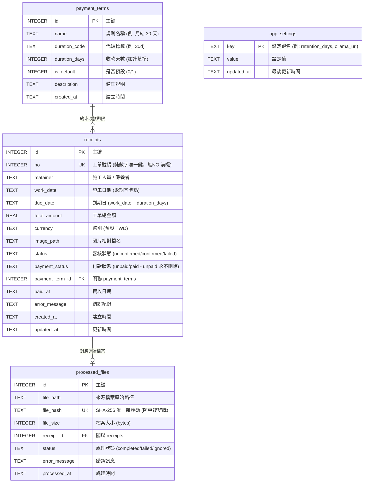

# WHassistant 資料庫結構與遷移說明 (Database Migrations)

本專案使用原生 **SQLite 3** 作為本地嵌入式資料庫，搭配 **WAL (Write-Ahead Logging)** 高效模式與外鍵約束保證資料完整性。

---

## 📍 一、 SQLite 資料庫存放位置 (Database Location)

應用程式遵從各作業系統標準的本機應用程式資料路徑（透過 Rust `dirs::data_local_dir()` 自動定位）：

| 作業系統 (OS) | 實體資料庫完整路徑 | 圖片儲存目錄 |
| :--- | :--- | :--- |
| **macOS** | `~/Library/Application Support/whassistant/whassistant.db` | `~/Library/Application Support/whassistant/receipts/images/` |
| **Windows** | `C:\Users\<使用者名稱>\AppData\Local\whassistant\whassistant.db` | `C:\Users\<使用者名稱>\AppData\Local\whassistant\receipts\images\` |
| **Linux** | `~/.local/share/whassistant/whassistant.db` | `~/.local/share/whassistant/receipts/images/` |

> [!NOTE]
> - 在 WAL 模式下，同目錄下可能會有暫存日誌檔 `whassistant.db-wal` 與共享記憶體檔 `whassistant.db-shm`，此為 SQLite 正常機制。
> - 跨平台備份或移轉時，請將 `whassistant.db` 與整個 `receipts/` 目錄一併複製。

---

## 🗄️ 二、 目錄結構與 DDL 檔案

```text
migrations/
├── 001_initial_schema.sql  # 初始資料庫結構 (DDL、索引與種子資料)
└── README.md              # 本說明文件 (路徑規範、表結構與使用指南)
```

---

## 📊 三、 資料表關聯結構 (Entity Relationship)



---

## ⚙️ 四、 自動遷移機制 (Auto-Migration)

本應用程式於啟動時在 `src/db/mod.rs` 中的 `Database::init()` 自動執行下列步驟：
1. **建立資料庫與連線池**：若檔案不存在則自動建立，啟用 WAL 模式。
2. **結構遷移 (`migrate`)**：執行 `CREATE TABLE IF NOT EXISTS` 與 `CREATE INDEX IF NOT EXISTS`。
3. **預設資料寫入 (`seed_defaults`)**：若無任何條款或設定，自動寫入即期/30天/60天/90天收款條款及預設系統設定。

---

## 🛠️ 五、 如何手動檢視或連線資料庫

### 1. 使用終端機 sqlite3 CLI
```bash
# macOS 快速進入 SQLite 命令列
sqlite3 "$HOME/Library/Application Support/whassistant/whassistant.db"

# 查看所有資料表
.tables

# 查看資料表欄位定義
.schema receipts

# 離開
.exit
```

### 2. 使用 GUI 資料庫工具
推薦以下免費且支援 SQLite 的視覺化工具：
- **TablePlus** (macOS / Windows)
- **DBeaver** (全平台)
- **DB Browser for SQLite** (全平台開源)

**連線方式**：開啟工具後選擇 SQLite，直接將上述對應平台的 `whassistant.db` 檔案拖入或開啟即可。
